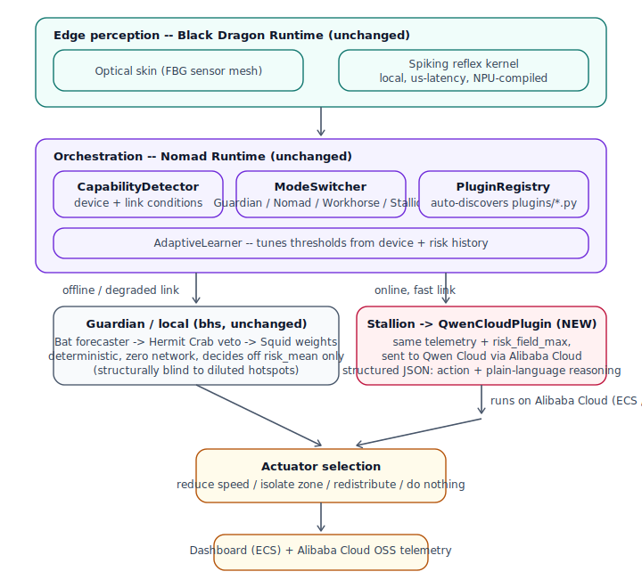

# Nomad Sentinel — Architecture



## System diagram (text version, for reference)

```
┌───────────────────────────────────────────────────────────────────┐
│  Edge perception  (Black Dragon Runtime, unchanged)                │
│  ┌───────────────────────────┐   ┌──────────────────────────────┐ │
│  │ Optical skin (FBG mesh)    │──▶│ Spiking reflex kernel (NPU)   │ │
│  │ dense IDW-interpolated     │   │ event-driven, µs-latency,     │ │
│  │ temperature/stress/vib     │   │ Ethos-U Vela compiled          │ │
│  └───────────────────────────┘   └──────────────────────────────┘ │
└──────────────────────────────────┬──────────────────────────────────┘
                                    │ risk field, spike activity, damage
                                    ▼
┌───────────────────────────────────────────────────────────────────┐
│  Orchestration  (Nomad Runtime, unchanged except MODEL_REGISTRY)    │
│  ┌─────────────────┐ ┌────────────────┐ ┌───────────────────────┐ │
│  │ CapabilityDetector│ │ ModeSwitcher   │ │ PluginRegistry         │ │
│  │ device ceiling    │ │ Guardian/Nomad/│ │ auto-discovers plugins │ │
│  │                    │ │ Workhorse/     │ │ dropped into plugins/  │ │
│  │                    │ │ Stallion       │ │                        │ │
│  └─────────────────┘ └────────────────┘ └───────────────────────┘ │
│  ┌─────────────────────────────────────────────────────────────┐   │
│  │ AdaptiveLearner — tunes thresholds from device + risk history │   │
│  └─────────────────────────────────────────────────────────────┘   │
└──────────────┬────────────────────────────────────┬─────────────────┘
               │ offline / degraded                  │ online, fast link
               ▼                                     ▼
┌───────────────────────────┐          ┌───────────────────────────────┐
│ Guardian / local (bhs)      │          │ Stallion → QwenCloudPlugin (NEW)│
│ Bat forecaster               │          │ same telemetry summary, sent    │
│ Hermit Crab veto              │          │ to Qwen Cloud via Alibaba Cloud │
│ Squid objective weights       │          │ structured JSON: risk, RUL,     │
│ deterministic, zero network   │          │ action, plain-language veto     │
│                                │          │ reasoning, confidence            │
└───────────────┬───────────────┘          └────────────────┬────────────────┘
                │                                            │
                └───────────────────┬────────────────────────┘
                                     ▼
                     ┌───────────────────────────────┐
                     │ Actuator selection              │
                     │ reduce speed / isolate zone /   │
                     │ redistribute load / do nothing  │
                     └───────────────┬─────────────────┘
                                     ▼
                     ┌───────────────────────────────┐
                     │ Dashboard + Alibaba Cloud OSS   │
                     │ (ECS-hosted, deploy/README.md)  │
                     └───────────────────────────────┘
```

## Why the split is where it is

**Reflex stays local, always.** A structural safety reflex (µs-latency
spiking kernel) must never depend on network availability — that's
true regardless of which hackathon this targets, and it's why Black
Dragon's sensing/reflex layer is untouched here.

**Cognition is where the tradeoff lives.** Forecasting, veto reasoning,
and objective weighting can afford to wait tens to hundreds of
milliseconds, so this is exactly the layer where "reason via cloud
APIs when you can, degrade gracefully when you can't" (the EdgeAgent
brief) applies. `CloudAugmentedCognition`
(`src/nomad_sentinel/bhs/cloud_cognition.py`) is the file that
implements that tradeoff: it always computes the local heuristic
result, and only replaces it with Qwen Cloud's result if the call
succeeds *and* returns a valid, schema-conformant action.

**The plugin boundary is what makes this cheap.** Nomad's
`InferencePlugin` contract (`runtime/core/plugin_base.py`) was written
generically enough that adding Qwen Cloud required exactly one new
file (`runtime/plugins/qwen_cloud_plugin.py`) and one config change
(pointing the pre-existing but previously-disabled `Stallion` mode at
it in `MODEL_REGISTRY`). `PluginRegistry.discover()` picks it up
automatically — no router or mode-switcher code changed.

## Failure modes and how they're handled

| Condition | What happens |
|---|---|
| Network drops mid-decision | `ModeSwitcher` downgrades (10s hysteresis, faster than the 30s upgrade hysteresis — "be cautious upgrading, be fast downgrading") to `Workhorse`/`Nomad`/`Guardian`; `CloudAugmentedCognition` never calls the cloud plugin outside `Stallion` mode |
| Qwen Cloud call times out or errors | `QwenCloudPlugin.infer()` never raises — returns a structured failure; `CloudAugmentedCognition._try_cloud()` returns `None` and the caller falls back to the local heuristic for that step |
| Qwen Cloud returns malformed JSON or an action outside the vetoed candidate set | Same fallback path — a bad cloud response degrades to "as if the cloud weren't there," never to an unsafe or unparseable actuator command |
| Device RAM/CPU/thermal pressure, even with network up | `ModeSwitcher`'s capability ceiling caps the proposed mode below what the hardware can't sustain, independent of network status |

This is demonstrated live by
[`scripts/run_edge_cloud_demo.py`](../scripts/run_edge_cloud_demo.py),
which runs Scenario D while a simulated network drops out for the
middle third of the run and recovers — see the README for output.
